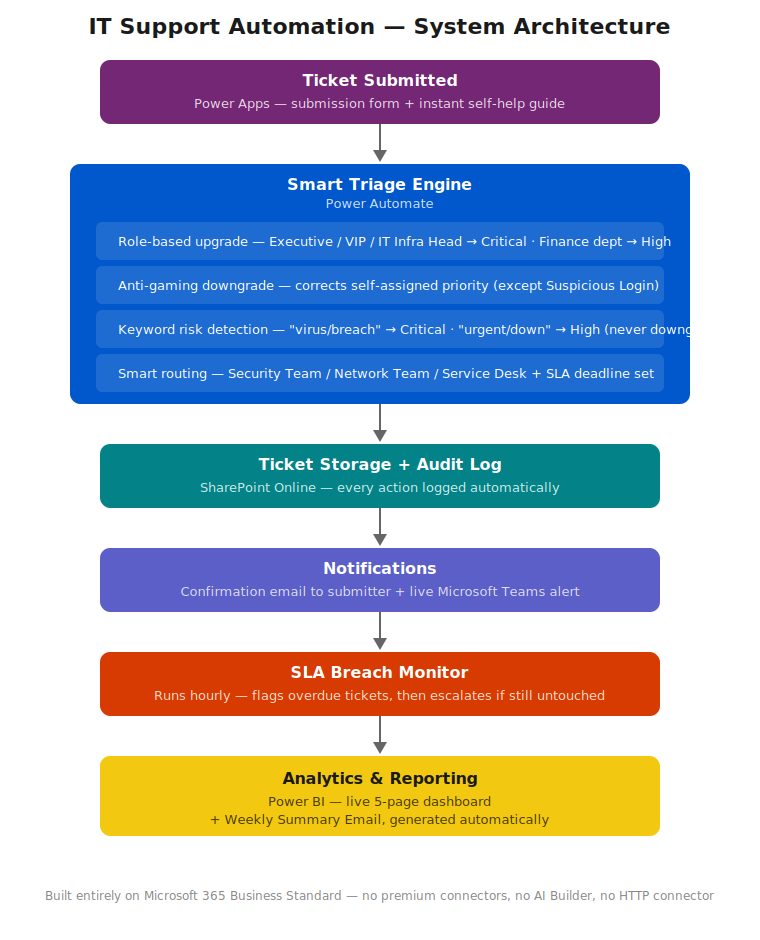

# IT Support Automation System
### Turning a manual, easy-to-miss ticket queue into a self-triaging, self-reporting helpdesk

---

## Contents
- [The Problem](#the-problem)
- [What This System Actually Does](#what-this-system-actually-does)
- [How It Works](#how-it-works)
- [Real-World Debugging: Five Production Bugs, Found and Fixed](#real-world-debugging-five-production-bugs-found-and-fixed)
- [Phase 1 — The Data Foundation (SharePoint)](#phase-1--the-data-foundation-sharepoint)
- [Phase 2 — The Submission Experience (Power Apps)](#phase-2--the-submission-experience-power-apps)
- [Phase 3 — The Intelligence Engine (Power Automate)](#phase-3--the-intelligence-engine-power-automate)
- [Phase 4 — Staying on Top of Deadlines](#phase-4--staying-on-top-of-deadlines)
- [Phase 5 — Seeing the Big Picture (Power BI)](#phase-5--seeing-the-big-picture-power-bi)
- [Known Limitations](#known-limitations)
- [What's Next](#whats-next)
- [The Evolution of This Project](#the-evolution-of-this-project)
- [Tech Stack](#tech-stack)

---

## The Problem

In most small IT teams, support requests land in a shared inbox or a flat list with no real way to tell which ones actually matter. A "my password isn't working" ticket sits right next to "I think someone just broke into my account," and there's nothing structurally different about how either one gets noticed. A technician has to read every single ticket, decide how urgent it really is, figure out who should handle it, and remember to keep an eye on the clock so nothing slips past its deadline.

That works fine when there are five tickets a day. It falls apart the moment there are fifty, and it's exactly the kind of place where a genuinely urgent issue, a security incident, a VIP outage, gets buried under routine noise and missed.

This project removes the guesswork. The moment a ticket is submitted, the system reads it, decides how serious it actually is, assigns it to the right team, tracks its deadline, and reports on all of it automatically. No technician has to manually triage anything. Along the way, maintaining this system surfaced five real production bugs, all found and fixed through hands-on debugging, more on that below.

## What This System Actually Does

- Reads every new ticket and automatically decides its priority based on **who submitted it** (Executives, VIPs, and the IT Infrastructure Head are never accidentally left at a low priority), **what they wrote** (the description is scanned for risk language like "virus" or "breach" and escalated automatically), and **what kind of problem it is**.
- Always treats Finance department tickets as High priority, no exceptions, and always treats Executive, VIP, and IT Infrastructure Head tickets as Critical, regardless of what the submitter selected, unless a more specific rule legitimately overrides it.
- Stops people from gaming the system: a regular employee can't tick "Critical" on a routine request and skip the queue, the system quietly corrects it back down, with one deliberate exception, a genuine Suspicious Login report always stays Critical, no matter who reports it.
- Automatically routes every ticket to the right team, Security, Network, or general Service Desk, with no manual sorting.
- Tracks every ticket's deadline in the background and automatically flags anything overdue, then escalates it further if it's still untouched an hour later.
- Offers instant self-service: when a Standard User reports one of three common issues, Password Reset, Printer Issue, or WIFI Issue, they're shown step-by-step troubleshooting before a ticket is even created, with the option to resolve it themselves on the spot.
- Enforces genuine Role-Based Access Control (RBAC): a regular employee only ever sees their own tickets, while the designated IT lead sees the entire queue, enforced by their actual Microsoft 365 identity, not a dropdown anyone could self-select.
- MFA (multi-factor authentication) is enforced tenant-wide, so access to the system itself is protected, not just the data inside it.
- Logs everything automatically in an audit trail, and reports on the whole system weekly, with no one compiling a single number by hand.
- Visualizes ticket trends, SLA performance, and team workload in a live, five-page analytics dashboard.

## How It Works

*From the moment a ticket is submitted to the moment it shows up in a live dashboard, every step is automatic.*

---

## Real-World Debugging: Five Production Bugs, Found and Fixed

Building this system was the easier part. Maintaining it, the way a real production system actually needs to be maintained, is where the harder, more valuable work happened. Here are five genuine bugs I found and fixed through methodical investigation: reading run histories, isolating variables, and confirming every fix with a live test before calling it done.

**1. A silently broken escalation rule.** When the submission form moved from SharePoint to Power Apps, one rule, meant to escalate Finance department tickets, got left behind referencing an outdated data source. It didn't throw an error, it just silently skipped itself on every single run. Finance tickets never escalated, and nothing in the system ever flagged it. Found by reading the flow's run history step by step and noticing the rule wasn't even being evaluated. Fixed by pointing it at the correct, current data source.

**2. A safety check accidentally undoing a more important one.** A keyword scanner designed to catch urgent language in ticket descriptions had no awareness of a ticket's current priority. An Executive's ticket correctly escalated to Critical could then get pulled back down to High moments later, if the description happened to also contain a word like "emergency," because the scanner blindly applied its own rule regardless of what priority was already set. Fixed by adding a check that reads the ticket's current state first and skips itself if the ticket is already at Critical.

**3. A real race condition on ticket creation.** SharePoint automatically calculates a ticket's ID in a quick background save right after creation. The automation was trying to write its own changes to that same brand-new ticket at almost the exact same instant, with no pause, causing the two saves to occasionally collide and the whole process to fail outright. Fixed by adding a short delay at the very start of the process, giving SharePoint time to finish its own work first.

**4. A stale schema cache hiding new data categories.** After adding new status values to the ticket list (like "In Progress" and "Breached"), they refused to appear anywhere in the Power BI dashboard's filters or slicers, even after refreshing. The standard refresh only pulls new rows of data, not new category definitions. The actual fix required forcing a full schema re-read inside Power BI's Power Query editor specifically, a behavior that's barely documented anywhere online.

**5. Filters and measures silently fighting each other.** Several KPI cards were originally built using a basic count combined with a visual-level filter. When the underlying data changed, the filters didn't update with it, producing blank or wrong totals even after the formulas themselves were correct. The real fix was rebuilding every KPI card as a proper calculated measure and removing the old filters entirely, since the two approaches don't combine safely, they quietly override each other.

---

## Phase 1 — The Data Foundation (SharePoint)

Every ticket lives in a structured SharePoint list: who submitted it, what kind of problem it is, how urgent it is, which device it affects, who's handling it, when it's due, whether it's been escalated, and any notes along the way. A second list, the Audit Log, automatically records a timestamped history of everything that happens to a ticket, no one types these entries by hand, the system writes them as events happen.

*The core ticket list, holding every request submitted into the system.*

*A wider view showing routing, deadlines, and status fields side by side.*

*Every status change is logged automatically, no manual record-keeping required.*

## Phase 2 — The Submission Experience (Power Apps)

This is what an employee actually sees. A clean submission form, with one extra feature most helpdesk systems skip entirely: if a Standard User selects one of three common, well-understood issues, Password Reset, Printer Issue, or WIFI Issue, the form immediately shows them a short troubleshooting guide before they even submit anything. If it solves their problem, they never have to file a ticket at all. If it doesn't, they submit as normal, and the system still recognizes the same situation on the backend and follows up with the same guidance by email, just in case.

Access is also genuinely role-based, real RBAC, not a cosmetic dropdown. A regular employee only ever sees their own tickets. The designated IT lead, verified through their actual Microsoft 365 job title rather than anything they could self-select on a form, sees every ticket in the system.

*The ticket submission screen.*

*Instant troubleshooting steps shown before a ticket is even created.*

*A regular employee's view, their own tickets only.*

*The IT lead's view of the same screen, every ticket, enforced by real identity-based RBAC.*

## Phase 3 — The Intelligence Engine (Power Automate)

This is where the actual decision-making happens. The moment a ticket is created, a chain of automated rules works through it in order:

- **Role-based escalation** — Executives, VIPs, and the IT Infrastructure Head are always forced to Critical, and Finance department tickets are always forced to High, regardless of what the submitter selected.
- **Anti-gaming protection** — a regular employee can't self-assign a high priority without justification, the system quietly corrects it back down, with one deliberate exception: a genuine Suspicious Login report always stays Critical, no matter who files it.
- **Content-aware risk detection** — the system reads the actual description text. Words like "virus," "breach," or "ransomware" force the ticket to Critical immediately, while words like "urgent" or "not working" push it to High, even if the person reporting it didn't realize how serious it was. This detection only ever escalates upward, it never has the power to drop a ticket below where role-based rules already placed it.
- **Smart routing** — based on the final priority and issue type, the ticket is automatically assigned to Security Team, Network Team, or Service Desk, with an appropriate SLA deadline attached.

*Role-based escalation in action.*

*Anti-gaming protection and content-based risk detection.*

*The full decision chain assigning the right team.*

## Phase 4 — Staying on Top of Deadlines

A separate background process checks every active ticket once an hour. If a deadline has passed, the ticket is automatically flagged as Breached. If it's still sitting untouched by the next check, it escalates further. Every step posts an alert directly into a Microsoft Teams channel and logs an entry to the audit trail, so nothing relies on someone remembering to check a list.

*The hourly deadline-monitoring logic.*

*A real-time alert the moment a ticket breaches its deadline.*

*Automatic confirmation sent the moment a ticket is submitted.*

*The backup troubleshooting email, sent even if the ticket still goes through.*

*Every new ticket is also posted instantly to the support team's Teams channel.*

*An automated weekly report, generated and sent without anyone compiling a single number by hand.*

## Phase 5 — Seeing the Big Picture (Power BI)

A live, five-page dashboard connected directly to the same data the technicians work from, no manual exports, no copy-pasting into spreadsheets.

*A top-level view of ticket volume, priority mix, and current status.*

*Breakdown by issue type, priority, status, and team.*

*Breach rates and escalation rates, the metrics that actually matter for accountability.*

*Workload comparison across Security, Network, and Service Desk.*

*Ticket volume and escalation trends over time.*

---

## Known Limitations

Being upfront about what isn't built yet:

- **No automated closing notification.** Marking a ticket "Resolved" is currently a manual action with nothing automated following up, no closing email to the person who submitted it, no final audit log entry. Planned for the next phase: a dedicated process that watches specifically for that status change and handles both.
- **Account Lockout isn't fully protected from the anti-gaming downgrade.** The downgrade protection currently has an explicit exception for Suspicious Login reports, but not yet for Account Lockout. Flagged as a real risk, not yet confirmed as an actual failure in testing, and earmarked for a future fix.
- **Manager-level escalation is currently basic.** Right now a Manager's ticket only gets bumped to Medium, and only if it was originally Low, there isn't yet a richer set of role-specific rules for Managers the way there is for Executives, VIPs, and the IT Infrastructure Head. Worth revisiting so Manager tickets get treatment that better reflects their actual role.

## What's Next

- **A self-service knowledge base.** Extending the self-help guide with a simple "search past tickets" or knowledge-base link-out, so common issues get resolved from a library of past solutions, not just the three hard-coded categories that exist today.
- **SLA performance trend by team.** Adding an average-resolution-time-by-team metric to the Power BI Ticket Timeline page, exactly the kind of operational metric a real MSP measures and reports on.
- **Richer Manager-level rules**, addressing the limitation above with a more complete escalation path for that role.
- **Longer-term, an exploratory idea**: lightweight sentiment analysis on ticket descriptions, to add another layer of risk detection beyond keyword matching. Not yet committed or built, but a natural next step once the current rule-based engine has been proven stable over real use.

## The Evolution of This Project

This system started life as a much simpler Microsoft Forms and Excel-based ticketing setup. That earlier version proved the concept; this one rebuilds it properly as a real, multi-layered automation system across SharePoint, Power Automate, Power Apps, and Power BI, with genuine production-style debugging along the way.

## Tech Stack

Microsoft SharePoint Online · Power Automate · Power Apps (Canvas) · Power BI · Microsoft Teams · Outlook · Microsoft 365 Business Standard, built without any premium connectors, AI Builder, or HTTP connectors, entirely within standard licensing.
